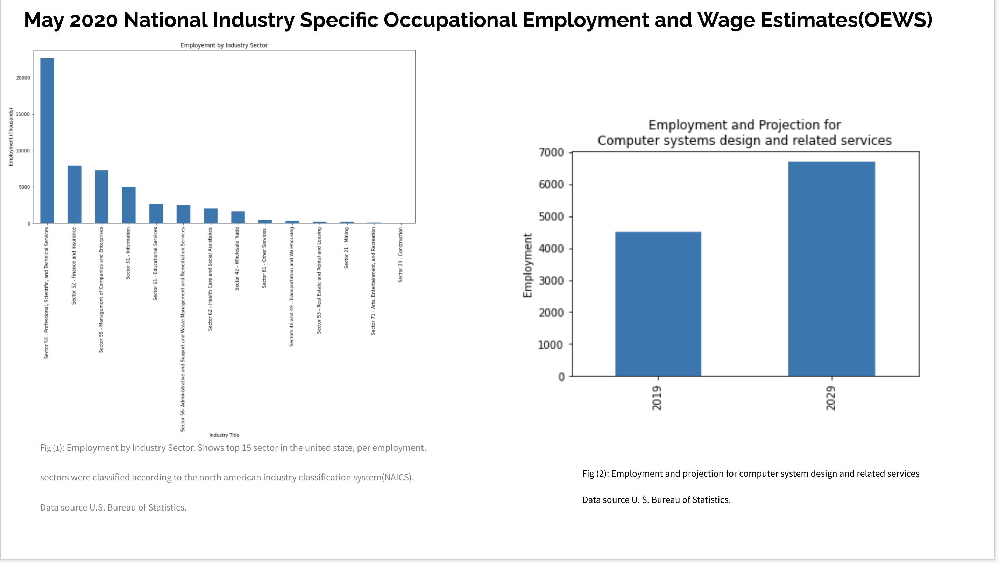
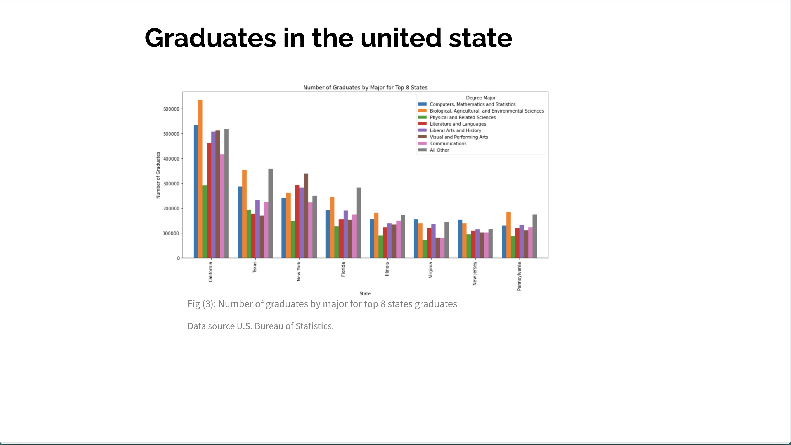
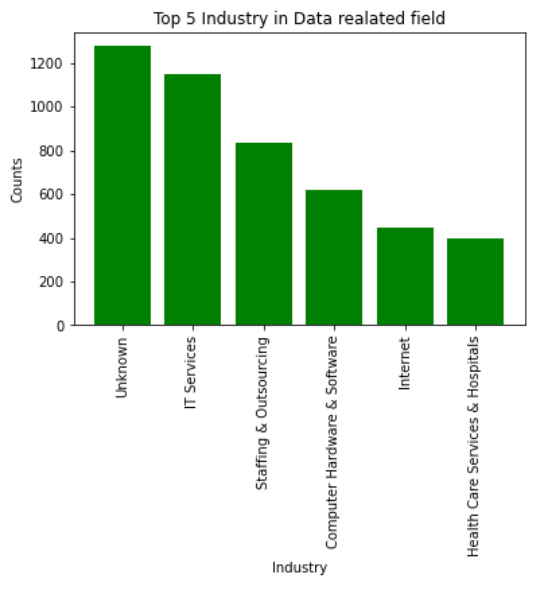
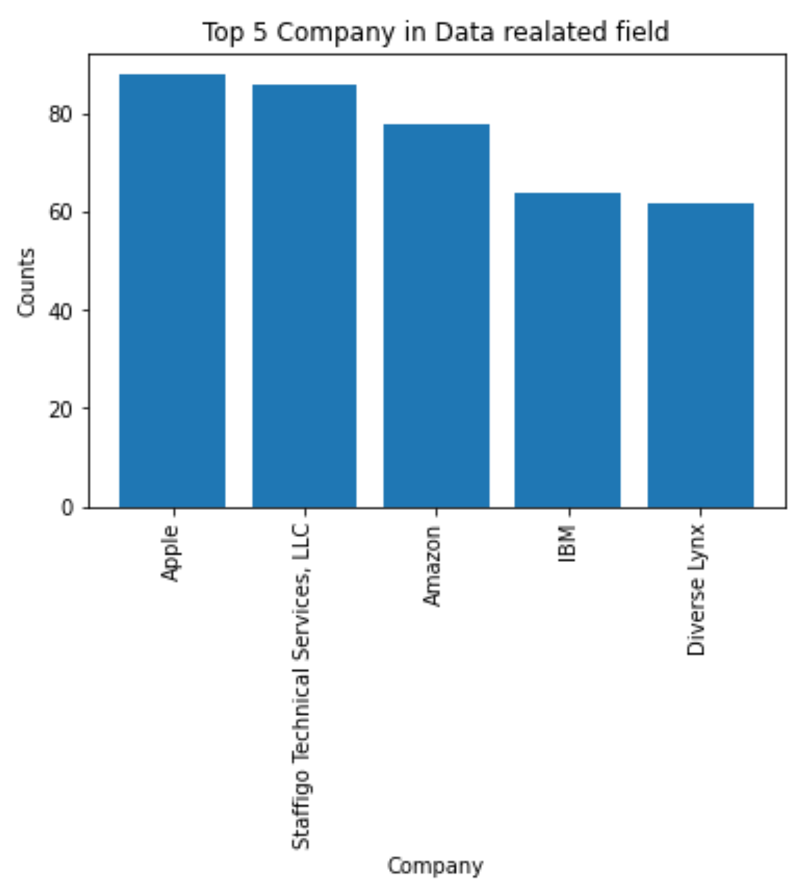
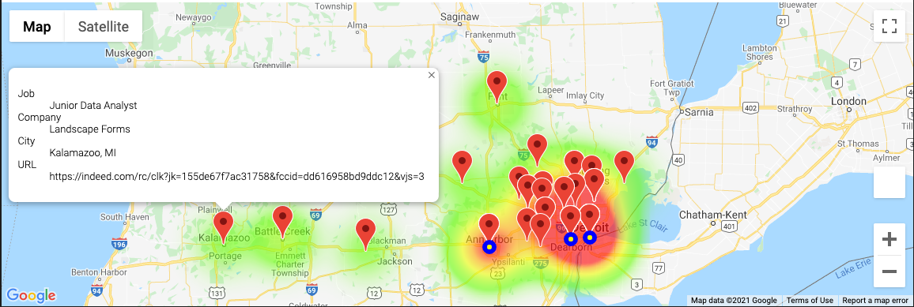
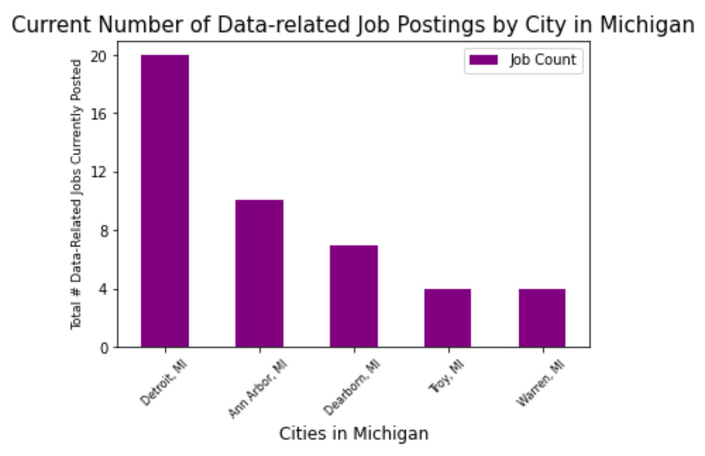
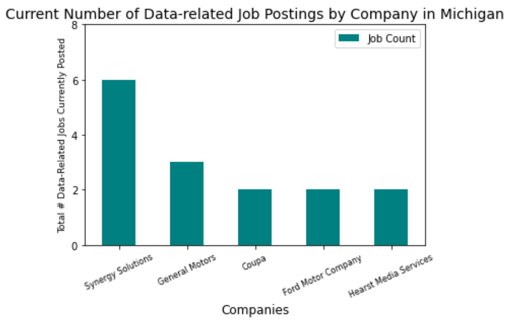
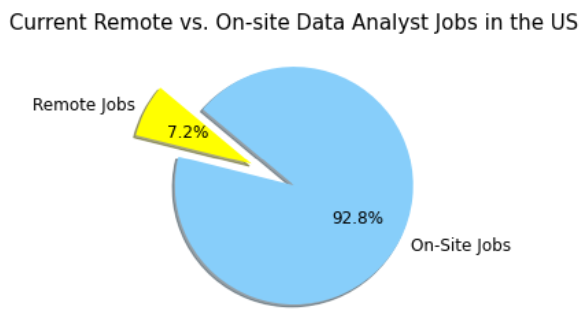

# Introduction to the Data-Related Job Market

The project provides an overview of the data-related employment sectors in the United States (US) per state. Data-related occuppations make up a new field that is expected to grow as the era of the Fourth Industrial Revolution arrives. The project investigates which states are best to apply to for data scientist positions based on job and salary data from the Bureau of Labor Statistics and the Cost-of-Living index from the World Population Review. It lists the top sectors per employment, the employment projection for 2029 and the top eight states with the largest number of university graduates by major. This project proceeds to explore and visualize which industries are currently looking for data-related jobs in the US, which companies, and which states are looking for the most employees using information from ‘glassdoor'. Additional exploration and visualizations were conducted with data scraped from Indeed. This focused on understanding the current data-related job market in Michigan and the US.

[Google Slides Presentation](https://docs.google.com/presentation/d/1UMRvgwzLTlg37O_Z83gloI1naE1pdOQcKXFxRQi5beY/edit?usp=sharing)

## Questions Associated with the Analysis

- Q1: What are the top sectors for employment?
- Q2: What is the projection for employment for computer system design and related services for 2029?
- Q3: What are the top eight states for number of graduates by major?
- Q4: Which states currently have the most data scientist positions?
- Q5: Which states pay Data Scientists the most?  
- Q6: Which states are best to apply to based on salary and cost of living?
- Q7: Currently, What are the top five industries with the most data-related job postings?
- Q8: Currently, what are the top five companies with the most data-related job postings?
- Q9: Which states are looking for the most data-related jobs?
- Q10: Where are the geographical hotspots for data-related jobs in Michigan?
- Q11: Where are the most data-related jobs by company and job location?
- Q12: What are the top three locations with the most data-related jobs posted?
- Q13: What are the top five *cities* in Michigan, currently with the most data-related job postings?
- Q14: What are the top five *companies* in Michigan, currently with the most data-related job postings?
- Q15: How many & what percentage of the Data Analyst jobs posted in the U.S. right now are *remote*?

## Data Sources

- [US Bureau of Labor Statistics](https://www.bls.gov/oes/current/oes152098.htm)
  - Occupational Employment and Wages, May 2020, Data Scientists and Mathematical Science Occupations, All Other
- [National Employment Matrix](https://data.bls.gov/projections/nationalMatrix?queryParams=15-2098-248&ioType=o)
  - Data Scientists and Mathematical Science Occupations, All Other
  - Employment by industry, occupation, and percent distribution, 2019 and projected 2029.
- [US Census Bureau](https://data.census.gov/cedsci/table?q=B15010&tid=ACSDT1Y2019.B15010)
  - 2019, American Community Survey 1-Year Estimates
  - Table ID: B15010
- [World Population Review](https://worldpopulationreview.com/state-rankings/cost-of-living-index-by-state)
  - Cost of Living Index By State, 2021.
- [Kaggle](Kaggle.com/datasets)
  - Glassdoor data
- [Indeed](Indeed.com)

## Datasets

Imported 2 CSV files from the Bureau of Labor Statistics:

- First CSV file was from the Bureau of Labor Statistics using the Occupational Employment and Wage Statistics Query System. This dataset extracted employment and salary information for Data Scientists per state in the US.
- Second CSV file contained information regarding the cost of living per state from the World Population Review.  The cost-of-living index is based on sustaining a certain standard of living by affording basic needs such as housing, food, healthcare, and more.

Glassdoor:

- Retrieved three CSV files from [kaggle](Kaggle.com/datasets).
- Each CSV files are Data Analyst, Data Scientist, Data Engineer job listings scraped from glassdoor which includes job title, salary, company name, location etc.
- Concatenated all CSV files to one ‘final’ CSV file.
- From the final data frame, visualized industry and company ranking with bar chart.
- By using geopy, retrieved latitude and longitude for each state.

Indeed:

- Extracted two CSV datasets using an open-source Indeed webscraping tool that may be found [here](https://github.com/vittoriotriassi/jobs_scraper).
- One dataset was for data-related current jobs (pulled 4/30/21) posted on Indeed within Michigan (called "Current MI Data Jobs.csv").  
  - "Data-related" meaning Data Analyst, Data Scientist, Data Engineer, Business Intelligence Analyst, etc. using the keyword "data" in the job title.
- The second dataset was for "Data Analyst" keyword-only current jobs (pulled 4/30/21) within the entire US (called "U.S. Data Analyst Jobs").  
- The `gmaps` library was used to obtain a map of Michigan.

## Limitations of the Dataset

- Missing data.
  - Dataset did not include all states.
  - Data on employment were missing for five states: Delaware, New Mexico, North Dakota, Vermont, and Wyoming.
  - Data on annual median wage were missing for four states, including Delaware, North Dakota, Vermont, and Wyoming, however, data for New Mexico was included.
  - Bureau of Labor Statistics did not have information on Delaware, North Dakota, Vermont, Wyoming.  These states were eliminated from the dataset.
- Bureau of Labor Statistics dataset did not separate Data Scientist employment and salary data based on experience levels (entry-level, senior, lead, etc.)
- Specific calculation to generate the cost-of-living index was not shared on the World Population Review.
- All datasets did not include search criteria for level of experience (entry-level, senior, etc.)
- Some salary estimation has broad ranges to use (ex. 12K to 200K).
- In the Michigan dataset, there were postings with the location of "Michigan" - these were cleaned out of the dataframes, any "United States" location postings were kept for the remote work analysis.

## About Occupational Employment and Wage Statistics (OEWS)

Estimates derived from three years of survey data, covering 1.1 million establishments and about 57 percent of the employment in the United States. Estimates are established for every May and November. This improves the reliability of estimates for detailed occupations in small geographical areas. Combining multiple years of data is necessary to obtain full coverage of the largest establishments. In order to reduce respondent burden, the OEWS survey samples these establishments with virtual certainty once every three years. Limitations associated with this estimation procedure are that it requires updating for the earlier years of data and limits the usefulness of OEWS data for time series analysis (Bureau of Labor Statistics, 2021).

## Definitions

- Data Scientists:
  - According to the 2018 Standard Occupational Classification System, a data scientist is defined as someone hired to develop and implement methods to transform raw data into meaningful information using data-oriented programming languages and visualization software. This includes the application of data mining, data modeling, natural language processing, and machine learning to extract, analyze, and present data from large structured and unstructured datasets (Bureau of Labor Statistics, 2020).
  - Data Scientists develop and implement a set of techniques or analytics applications to transform raw data into meaningful information using data-oriented programming languages and visualization software. Apply data mining, data modeling, natural language processing, and machine learning to extract and analyze information from large structured and unstructured datasets. Visualize, interpret, and report data findings. May create dynamic data reports. Excludes Statisticians, Cartographers and Photogrammetrists, and Health Information Technologists and Medical Registrars.
    - Illustrative examples: Business Intelligence Developer, Data Analytics Specialist, Data Mining Analyst, Data Visualization Developer.
- Mathematical Science Occupations, all other:
  - All mathematical scientists not listed separately.
  - Illustrative examples: Harmonic Analyst, Mathematical Engineering Technician.
- Employment:
  - The estimated total occupational employment (not including self-employed).
- Employment per 1,000 jobs:
  - The number of jobs (employment) in the given occupation per 1,000 jobs in the given area.
- Location Quotient (State, metropolitan, and nonmetropolitan statistical area estimates only):
  - The ratio of an occupation's share of employment in a given area to that occupation's share of employment in the U.S. as a whole.
  - For example, an occupation that makes up 10 percent of employment in a specific metropolitan area compared with 2 percent of U.S. employment would have a location quotient of 5 for the area in question.
- Median Wage:
  - The estimated 50th percentile of the distribution of wages based on data collected from employers in all industries; 50 percent of workers in an occupation earn less than the median wage, and 50 percent earn more than the median wage.

## Analysis

Three bar charts represent employment by industry sector, employment and projection for computer systems design and related services for 2029, and the number of graduates by major for the top eight states.

Q1. What are the top sectors for employment?

A1:

1. Professional, scientific, and technical services
2. Finance and insurance
3. Management of companies and enterprises
4. Information
5. Educational services
6. Health care and social assistance
7. Wholesale trade
8. Other services
9. Transportation and warehousing
10. Real estate and rental and leasing
11. Arts, entertainment, and recreation construction [Fig (1)](Resources/Images/National_Industry_Employment.png)

Q2. What is the projection for employment for computer system design and related services for 2029?

A2: Employment Percent will increase by 48.7% in 2029. [Fig (2)](Resources/Images/National_Industry_Employment.png)

Q3. What are the top eight states for number of graduates by major?

A3:

1. California
2. Texas
3. New York
4. Florida
5. Illinois
6. Virginia
7. New Jersey
8. Pennsylvania

Q4: Which states currently have the most data scientist positions?

A4:

1. California (9,510)
2. Texas (4,310)
3. New York (3,950)
4. Illinois (3,290)
5. Washington (2,610)

Q5:  Which states pay Data Scientists the most?

A5:

1. California ($129,060)
2. New York ($124,240)
3. Washington ($118,320)
4. North Carolina ($117,370)
5. New Jersey ($116,250)

### Mean Salary vs. Cost of Living

Scatter plot showing which states would be the best places to apply for Data Scientist positions based on mean salary and cost of living.

Q7: Currently, What are the top five industries with the most data-related job postings?

A7:

1. IT Services (1,152 job postings)
2. Staffing & Outsourcing (838 job postings)
3. Computer Hardware & Software (619 job postings)
4. Internet (448 job postings)
5. Health Care Services & Hospitals (399 job postings)

Q8: Currently, what are the top five companies with the most data-related job postings?

A8:

1. Apple (88 job postings)
2. Staffigo Technical Services, LLC (86 job postings)
3. Amazon (78 job postings)
4. IBM (64 job postings)
5. Diverse Lynx (62 job postings)

Q9: Which states are looking for the most data-related jobs?

A9:

1. New York, NY (800)
2. Chicago, IL (652)
3. Austin, TX (625)
4. San Diego, CA (561)
5. Houston, TX (490)

### Heatmap

See google map with heatmap layer, marker layer, and symbol layer. The heatmap is showing that most data-related jobs exist on the East side of Michigan (metro Detroit to Ann Arbor region). The markers depict a sample job from each city with the job title, company, city, and URL. The three yellow symbols highlight the three cities with the most job postings (Detroit, Ann Arbor, and Dearborn).

The job counts from these top five cities account for 63% of the overall data-related jobs in Michigan.

1. Detroit (20 jobs)
2. Ann Arbor (10)
3. Dearborn (7)
4. Troy (4)
5. Warren (4)

The job counts from these top five companies account for 21% of the overall data-related jobs in Michigan.

1. Synergy Solutions (6 jobs)
2. General Motors (3)
3. Coupa (2)
4. Ford Motor Company (2)
5. Hearst Media Services (2)

There are 6813 Data Analyst jobs currently posted in the US on Indeed.  There are **490** remote Data Analyst jobs and 6323 on-site jobs.

- **7.2%** of Data Analyst jobs posted in the US are remote, 92.8% are on-site jobs.

## Employment and Wage Analysis

Each US state and the District of Columbia (DC) were compared on several variables. First, by data scientist employment per 1,000 people 25 years of age and older with at least one bachelor’s degree. The second variable was annual median wage, from 10th to 90th percentile, for data scientists by each US state and DC. Data on employment were collected from the Bureau of Labor Statistics' Occupational Employment and Wage Statistics, May 2020 estimates for data scientists and all other mathematical science occupations. Data on educational attainment, degree type, and academic field were collected from the US Census 2019 American Community Survey, 1 year estimate.

### Findings

The five states with the highest employment of data scientists per 1,000 people 25 years of age and older with at least one bachelor’s degree were Illinois, Florida, North Carolina, Maryland, and Tennessee. All five states had over 1,000 total data scientist positions, and from five to nearly ten positions per 1,000 people 25 and over with a bachelor’s degree in any field. Illinois had the highest employment per 1,000 people 25 and older with a bachelor’s degree, with 9.8 data scientist positions per person and 3,290 total. Tennessee had both the lowest employment and lowest employment per 1,000 people 25 and older with a degree among the top five states. Tennessee had 1,280 employments, with five employments per 1,000 people 25 and older with a degree. 

The annual median wage for data scientists in Illinois was $96,500. The 10th percentile was $56,100 and the 90th percentile was $154,010. Tennessee had a lower annual median wage, at $78,750. The 10th percentile was $52,550. The 90th percentile was $135,860. The five states with the highest annual median wage were California, New York, Washington, New Jersey, and Arizona. Of these, all were above $100,000. The state with the highest median wage was California, equaling $127,310 per year. It also had the highest 90th percentile wage, at $197,890 per year. California also had the greatest employment, at 9,510. There was, however, only one position per 1,000 people 25 years and older with a bachelor’s degree. Arizona was the lowest with a $111,900 annual median wage. Surprisingly, Arkansas’s 10th percentile in annual median wage was $80,310, the highest in the US. The lowest was Mississippi with a $31,200 10th percentile annual median wage. Michigan had 1,940 data scientist positions, or 0.889 for every 1,000 people 25 years of age and older with at least one bachelor’s degree. The median wage for a data scientist in Michigan was $74,730 per year. The 10th percentile was $46,570 and the 90th percentile was $120,250.

## Authors

- **David W. Mueller**
  - [LinkedIn Profile](https://www.linkedin.com/in/davidwaltermueller/)
  - davemuelle@gmail.com
- **Chloe Lee**
  - [LinkedIn Profile](https://www.linkedin.com/in/chloe-lee-858b34b8/)
- **Amanda Pesch**
  - [LinkedIn Profile](https://www.linkedin.com/in/amanda-pesch-6a45a155/)
- **Rna Babikar**
- **John Burke**

## Acknowledgments

- Michigan State University Data Analytics Bootcamp; May 9, 2021.

## References

Bureau of Labor Statistics. (2020, April 17). 2018 Standard Occupational Classification System. <https://www.bls.gov/soc/2018/home.htm>

Bureau of Labor Statistics. (2020). Employment Projections. U.S. Department of Labor. <https://data.bls.gov/projections/nationalMatrix?queryParams=15-2098-248&ioType=o>

Bureau of Labor Statistics. (2020, February 27). North American Industry Classification System (NAICS) at BLS. <https://www.bls.gov/bls/naics.htm>

Bureau of Labor Statistics. (2021). Occupational Employment and Wage Statistics, May 2020. U.S. Department of Labor. <https://www.bls.gov/oes/current/oes152098.htm>

U.S. Census Bureau. (2020). 2019 American Community Survey 1-Year. Detailed Field of Bachelor’s Degree for First Major for the Population 25 Years and Over. U.S. Census Bureau. <https://data.census.gov/cedsci/table?q=B15010&tid=ACSDT1Y2019.B15010>

World Population Review. (2021). Cost of Living Index By State 2021. [Data set]. World Population Review. <https://worldpopulationreview.com/state-rankings/cost-of-living-index-by-state>
